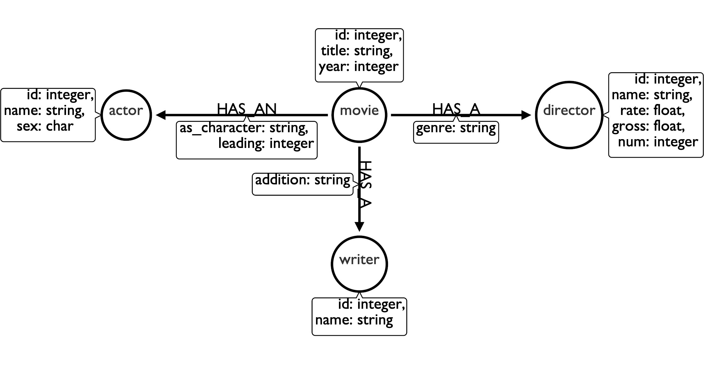

- We have 5 entities:
    - Actor
    - Director
    - Movie
    - Writer
- And 5 relationships:
    - movie->director (many-to-many)
    - movie->running_time (one-to-one)
    - movie->writer (many-to-one?)(property?)
    - movie->actor (many-to-many)
    - movie->rating (one-to-one?)(property?)

#### Entity Relationship Diagram

